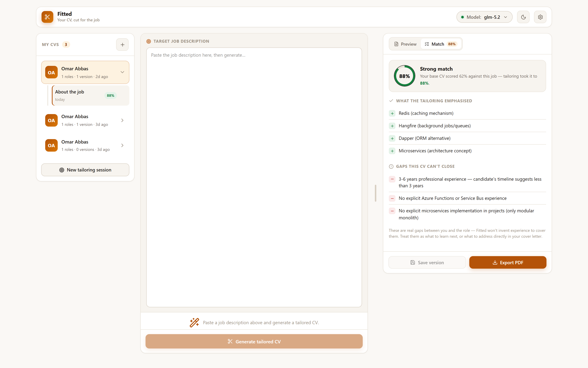
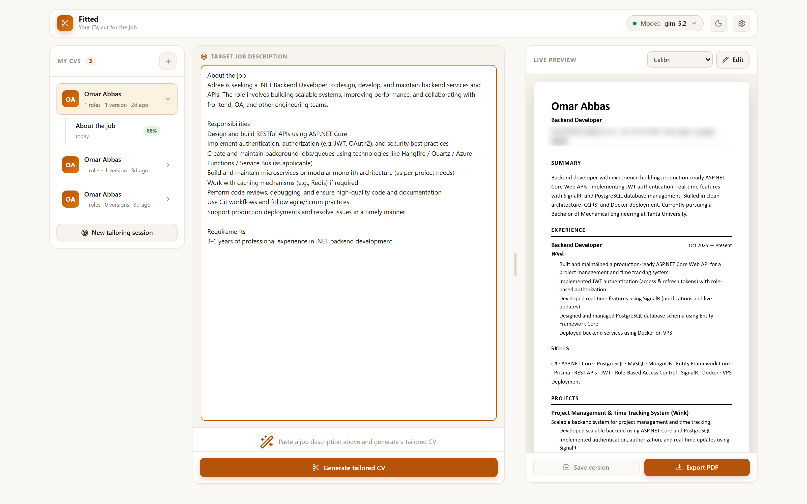
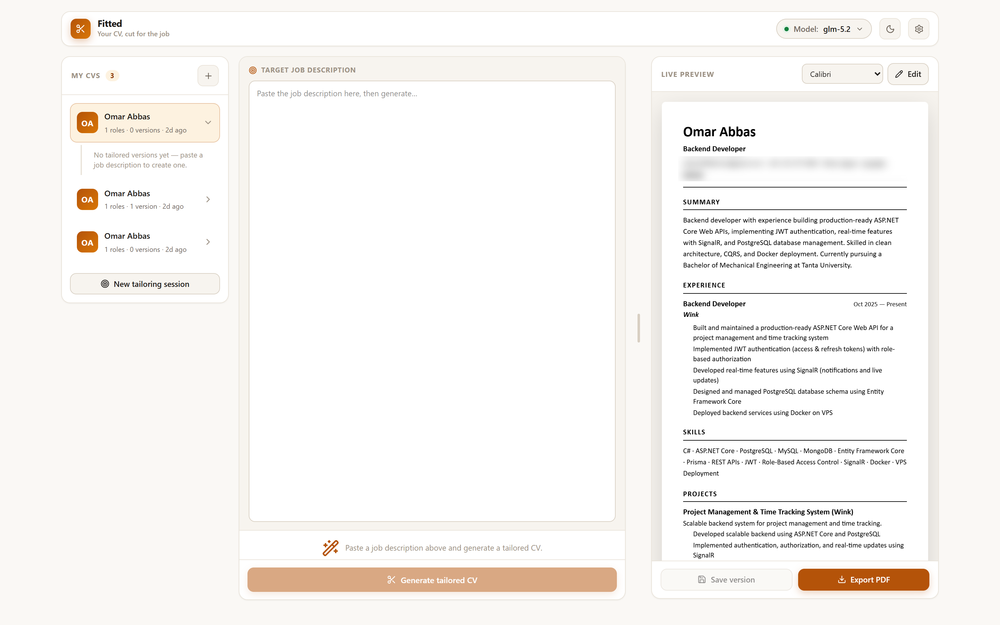
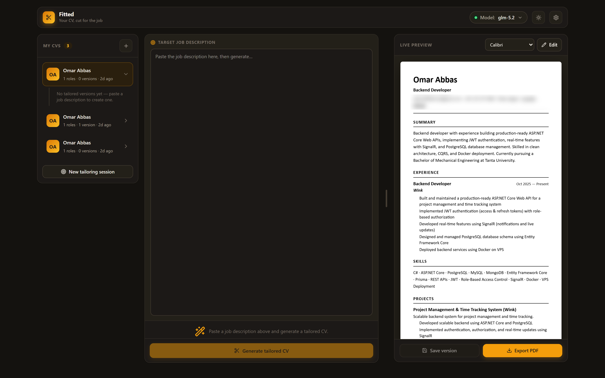

# Fitted

> Your CV, cut for the job.

Paste a job description, and Fitted rewrites your CV to lead with the parts that actually matter
for that role — then scores the result against the job and reports what it thinks you're still
missing.



Above: a real run against a .NET backend role. The base CV scored **62%** against the job;
the tailored version scored **88%**. The **Gaps** panel is the part worth reading — here it
reports *"3–6 years professional experience — candidate's timeline suggests less than 3 years"*
and *"No explicit Azure Functions or Service Bus experience."* Those are the things to prepare
for in the interview, or to close before applying.

## What it does

Fitted opens on a chooser, because these are three different jobs that want three different
screens:

### ✎ Edit my CV with AI

Chat your way through your own CV: tighten the summary, add a project, cut a role, add the metrics
you actually have. What you type is taken as fact and written in — and nothing more than what you
typed, which is the one hard limit. The chat is a saved session you can come back to.

Nothing touches your CV until you press **Save to my CV**. Until then it's a draft you can inspect
in the **Diff** tab, change by change.

### ✂ Tailor to a job

Paste a job description and generate. The CV streams in as it's written, and both versions are
scored against the job so you can see what the tailoring bought you.

- The **Match** tab gives two lists: what the tailoring emphasised, and the gaps it can't close.
- The **Diff** tab shows every change against your base CV, bullet by bullet, and flags in red any
  skill the tailored CV claims that your base CV never evidenced.
- The chat has two threads. **Tailor** only reshuffles what you can already prove; **Edit** takes
  what you type as fact. Facts added in Edit can be folded back into your base CV, so the next job
  starts from them.
- **Save a version** against that job, and **export a PDF** any time.

### ✨ Create a new CV

Start from an empty CV with the form on one side and a checklist on the other: what's still
missing, worst first — a role with no dates, bullets with no numbers, no summary. Answer any of
them and they're written in. "Ask AI what else it needs" adds the questions a rule can't ask, about
whether your bullets actually say anything.



Every tailored CV is stored as a version tied to its job, so you can go back to exactly what you
sent someone three weeks ago.

<details>
<summary><b>Light and dark themes</b> — click to expand</summary>

<br>

Theme follows your system by default and is stamped before first paint, so it never flashes.

**Light**



**Dark**



</details>

## The gap report

Alongside the rewritten CV, every run returns two lists: what the tailoring leaned on, and the
requirements it judged you don't meet. The second list is the interesting one — it's the tool
telling you where you actually fall short of the role, instead of quietly smoothing it over.

Two things keep that honest, because a prompt alone can't:

- **The prompt forbids invention.** The tailoring rules in `src/lib/ai.ts` bind every skill,
  technology, and claim to something already in your base CV. Surfacing "REST APIs" out of a bullet
  that describes building them is the point; introducing a term the CV never supports is not, however
  central it is to the job. Anything unsupported is supposed to land in the gap list instead.
- **The Diff tab checks the result.** Prompts are guidance, not a guarantee, so every generated CV is
  diffed against the base one and any skill with no supporting text anywhere in your base CV is
  flagged in red. That check is a plain function over both documents (`src/lib/cv-diff.ts`) — it
  doesn't ask the model whether the model behaved.

Still treat a generated CV as a draft to review. The difference is that you now have something
specific to review it against.

## Stack

- **Next.js 16** (App Router, TypeScript) with **Server Actions** for mutations, plus two
  streaming **Route Handlers** (`/api/tailor`, `/api/chat`) that relay the model's output as NDJSON
  so the preview fills in while the CV is still being written
- **Prisma 7** → **MySQL**, via the `@prisma/adapter-mariadb` driver adapter
- **Anthropic SDK** pointed at [AgentRouter](https://agentrouter.org). If a call comes back
  `503 无可用渠道` ("no available channel"), that model has no upstream behind it any more — check
  `GET /v1/models` with your key and switch the model in Settings. AgentRouter only accepts the
  Claude Code wire image — Anthropic Messages API + Claude Code headers + streaming — which
  `src/lib/ai.ts` handles. Model, base URL, and API key are all editable from the UI and stored in
  the database, so switching models needs no redeploy.
- **unpdf** for PDF text extraction, **Puppeteer** for PDF export
- **lucide-react** for icons; hand-rolled CSS design tokens, no component library

## Setup

Requires Node 20+ and a local MySQL server.

```bash
git clone https://github.com/omarabbas32/fitted.git
cd fitted
npm install
cp .env.example .env     # then edit DATABASE_URL
npm run db:migrate       # creates the database + tables
npm run dev              # http://localhost:3000
```

Then click the **model pill** in the top bar (or the **gear**) and paste your AgentRouter API key.
Base URL defaults to `https://agentrouter.org/v1`; set the model to anything your key can reach.

The API key is stored in your local database and only ever used server-side — it is never sent to
the browser.

## Project layout

| Path | What's in it |
| --- | --- |
| `prisma/schema.prisma` | `Cv`, `Job`, `Conversation`, `Message`, `CvVersion`, `Setting`. A `Conversation` with no job is an edit session |
| `src/lib/ai.ts` | AgentRouter client + the parse / tailor / refine / merge / review prompts |
| `src/lib/tailoring.ts` | The tailor / chat / edit operations, shared by the actions and the streaming routes |
| `src/lib/cv-diff.ts` | Structural diff against the base CV, incl. the unsupported-skill check |
| `src/lib/intake.ts` | Rule-based "what's missing from this CV", no model call |
| `src/lib/partial-json.ts` | Parses the half-written JSON arriving mid-stream |
| `src/lib/stream-protocol.ts` | The NDJSON event format, both ends of it |
| `src/app/api/` | `tailor`, `chat`, `edit` — the streaming endpoints |
| `src/lib/settings.ts` | Reads/writes the UI-editable AI config |
| `src/lib/pdf/` | `extract.ts` (unpdf), `template.ts` (HTML), `render.ts` (Puppeteer) |
| `src/app/actions/` | Server actions — `cv`, `tailor`, `version`, `settings`, `edit` |
| `src/components/HomeScreen.tsx` | The chooser: edit / tailor / create |
| `src/components/Dashboard.tsx` | The workspace shell and the three-pane UI |
| `src/components/CvDiffView.tsx` | The Diff tab |
| `src/components/IntakePanel.tsx` | The Improve tab |

`src/lib/ai.ts` is the only file to touch if your provider's API differs.

## Notes

- The rendered CV is deliberately black-on-white with no colour or multi-column layout, in both the
  preview and the exported PDF. ATS parsers choke on anything fancier.
- This is a personal tool, built for one user on one machine. There's no auth, no multi-tenancy, and
  no rate limiting — don't put it on the public internet as-is.

## Known issues / roadmap

1. **Generation is still a whole document.** Every tweak asks the model to re-emit the entire CV
   as JSON, and latency scales with output tokens, so a one-line change costs a full document.
   Streaming hides most of the wait — you watch it being written — but returning a patch instead
   would make refinements genuinely faster rather than just legible. This is the top item.
2. **The unsupported-skill check is textual.** It asks whether a claimed skill appears anywhere in
   the base CV, with light stemming. It will not catch a fabricated *metric* inside an otherwise
   real bullet, and it can miss a genuine synonym ("Postgres" vs "PostgreSQL"). It is a smoke
   alarm, not a proof.
3. **The Improve tab's AI review costs a model call** every time you ask for it, and its questions
   are not deduplicated against ones you have already answered in a previous session.
4. **No auth, one user.** Unchanged, and still the reason not to put this on the public internet.

## License

MIT — see [LICENSE](LICENSE).
